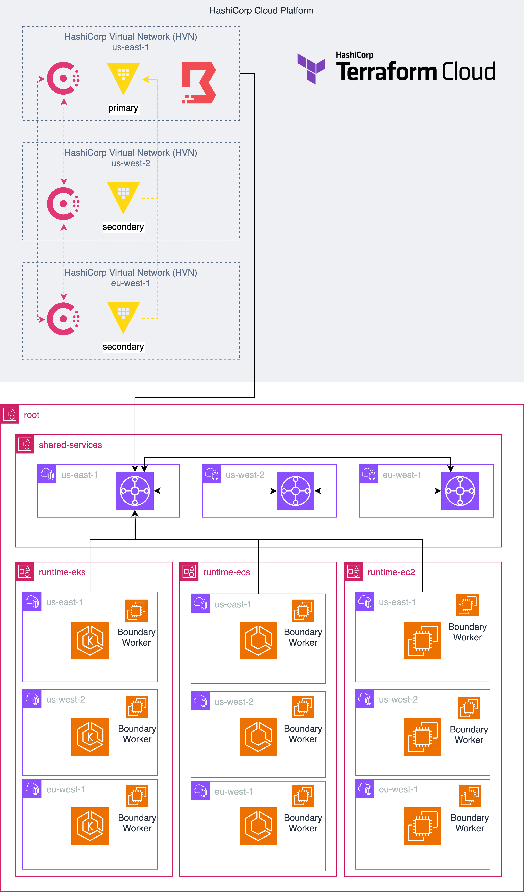

# Foundational Service Oriented Architecture

This is a set of Terraform configuration for multi-account, multi-region,
and multi-runtime on AWS.

## Directories

Top-level directories have Terraform configuration for each AWS account.

You'll find additional configuration in each directory.

- `scripts` - additional scripts that...
   - Reset Boundary workers (due to instances not being in autoscaling group)
   - Load data into a database
   - Retrieve SSH keys to connect to Boundary (TODO: Add these SSH keys to Vault)
- `modules` - Terraform modules used for a specific runtime or across runtimes
- `region` - module to duplicate resources across regions

## Setup

1. Fork this repository.

1. Set up the following AWS accounts:
   - `root` - root organization
   - `shared_services`
   - `runtime_ec2`
   - `runtime_ecs`
   - `runtime_eks`
   - `runtime_frontend`

1. Create a HashiCorp Cloud Platform organization.
   - HCP Consul must be **plus** tier for cluster peering.
   - HCP Vault must be **plus** tier for performance replication.
   - HCP Boundary can be **cloud** tier.

1. Create a Terraform Cloud organization.

1. Set up a [Terraform Cloud VCS connection](https://developer.hashicorp.com/terraform/cloud-docs/vcs) to your fork.

1. Set up Terraform Cloud workspaces and link them to the following
   working directories in VCS settings.
   - `root` - `root/`
   - `shared-services` - `shared_services/`
       - `shared-services-vault` - `shared_services/vault/`
       - `shared-services-consul` - `shared_services/consul/`
       - `shared-services-boundary` - `shared_services/boundary/`
   - `runtime-ec2` - `runtime_ec2/`
   - `runtime-ecs` - `runtime_ecs/`
       - `runtime-ecs-applications` - `runtime_ecs/applications`
   - `runtime-eks` - `runtime_eks`
       - `runtime-eks-kubernetes` - `runtime_eks/kubernetes`
       - `runtime-eks-applications` - `runtime_eks/applications`
   - `runtime-frontend` - `runtime_frontend`

1. Set up [dynamic credentials](https://developer.hashicorp.com/terraform/tutorials/cloud/dynamic-credentials)
   using a service role in each of your AWS accounts and link them to each Terraform Cloud workspace.

1. Set up [a global variable set]() with the following variables:
   - `terraform_cloud_organization` - Terraform variable - the Terraform Cloud organization you created
   - `HCP_CLIENT_ID` - environment variable - HCP Client credentials
   - `HCP_CLIENT_SECRET` - environment variable - HCP Client credentials
   - `HCP_PROJECT_ID` - environment variable - HCP Client credentials

1. Make sure all workspaces share their remote state with each other.
   - You can limit this further but the ease of demonstration, it is easier to share values.

1. Apply Terraform Cloud runs in each workspace.

## Explore

### Boundary

#### SSH into instances

#### Access internal API gateway endpoint on EKS

#### Access database as administrator

### Consul

#### Connect to external database service

#### Connect between runtimes

### Vault

#### Use static secrets in application

#### Use dynamic database credentials in application

#### Issue certificates for Consul service mesh